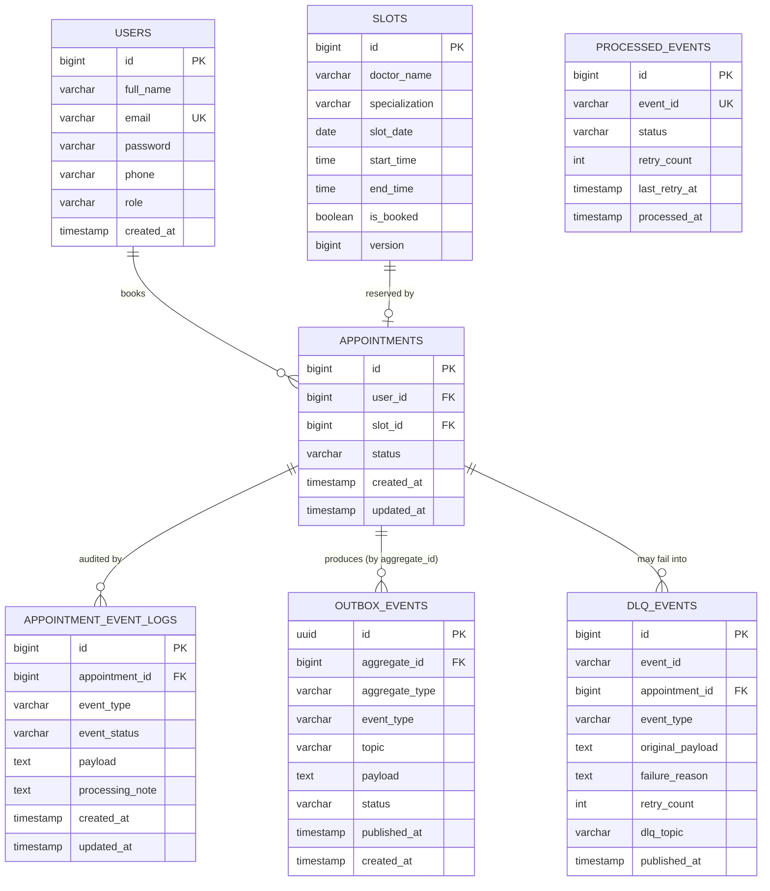

# 🏥 Meridian Health — Healthcare Appointment Management Platform

A production-style, event-driven healthcare appointment booking system built with
**Spring Boot**, a **Python** notification worker, **Kafka**, **PostgreSQL**, **Next.js**,
and **Docker**.

---

## 📦 Deliverables

| Deliverable | Where to find it |
|---|---|
| 📁 GitHub Repository (Backend + Frontend) | `<your-repo-url>` — see [Repository Links](#0-repository-links) |
| 📘 API Documentation & Swagger Link | [Section 6 — API Reference](#6-api-reference) + live Swagger UI at `/swagger-ui.html` |
| 🗄️ Database Schema | [Section 7 — Database Schema](#7-database-schema) + [`db/schema.sql`](./db/schema.sql) |
| 📄 README with setup instructions | This file — [Section 4](#4-running-locally-docker--recommended) / [Section 5](#5-running-without-docker-local-dev) |
| 🎥 Demo Video / Screenshots | [Section 10 — Demo Video & Screenshots](#10-demo-video--screenshots) |

---

## 0. Repository Links

| Component | Path in repo | Link |
|---|---|---|
| Backend (Spring Boot) | `/backend-spring` | `<add-link-or-leave-as-monorepo-subfolder>` |
| Worker (Python/FastAPI) | `/worker-python` | `<add-link-or-leave-as-monorepo-subfolder>` |
| Frontend (Next.js) | `/frontend-nextjs` | `<add-link-or-leave-as-monorepo-subfolder>` |
| Full source | repo root | `<your-repo-url>` |

> This project is structured as a single monorepo containing all three services. Replace `<your-repo-url>` above with the actual GitHub URL before sharing.

---

## 1. Architecture

```
┌──────────────┐      REST/JWT      ┌────────────────────┐
│  Next.js UI  │ ──────────────────▶│   Spring Boot API   │
│ (port 3000)  │◀──────────────────  │     (port 8080)     │
└──────┬───────┘                    └─────────┬────────────┘
       │  polls worker for                    │ publishes
       │  live event status                   │ Kafka events
       ▼                                       ▼
┌──────────────┐     Kafka topic     ┌────────────────────┐
│ Python Worker│◀────────────────────│   appointment-events│
│  (FastAPI)   │   "appointment-     │       topic         │
│ (port 8000)  │      events"        └────────────────────┘
└──────┬───────┘
       │ writes processing status
       ▼
┌──────────────┐
│  PostgreSQL  │◀── shared by both services (Spring Boot owns schema)
│ (port 5432)  │
└──────────────┘
```

**Flow:**
1. User registers/logs in via Spring Boot → receives a JWT.
2. User books an appointment → Spring Boot locks the slot row (pessimistic lock),
   validates availability, persists the appointment, and writes an
   `APPOINTMENT_CREATED` event to the transactional **outbox** table.
3. A scheduled `OutboxPublisher` polls the outbox and publishes pending events to
   Kafka, guaranteeing at-least-once delivery even if Kafka is briefly unavailable.
4. The Python worker consumes the event, claims it idempotently (via
   `processed_events`), simulates sending a notification (email/SMS) with
   retry + exponential backoff, and writes the processing result back to
   Postgres (`appointment_event_logs` + `appointments.status`). Exhausted
   retries are routed to a dead-letter queue (`appointment-events-dlq` /
   `dlq_events` table).
5. The worker also pushes live status straight to the Spring Boot backend via
   an internal, token-authenticated `POST /ws/notify` call, which the backend
   then broadcasts over WebSocket/STOMP to subscribed frontend clients.
6. The Next.js UI subscribes over WebSocket (with REST polling as a fallback)
   so the booking status visibly transitions:
   `Processing → Confirmed → Confirmed & Notified` in real time.
7. Cancellation follows the same event-driven path with `APPOINTMENT_CANCELLED`.

---

## 2. Tech Stack

| Layer            | Technology                          |
|-------------------|--------------------------------------|
| Backend Core      | Spring Boot 3.2 (Java 17)            |
| Worker Service    | Python 3.11, FastAPI, kafka-python   |
| Database          | PostgreSQL 16                        |
| Messaging         | Apache Kafka                         |
| Auth              | JWT (jjwt) + Spring Security         |
| Real-time updates | WebSocket / STOMP (Spring) + polling fallback |
| Reliability       | Outbox pattern, idempotent consumer, DLQ, retry w/ backoff |
| Rate limiting     | Bucket4j (login & booking endpoints) |
| API Docs          | springdoc-openapi / Swagger UI       |
| Frontend          | Next.js 14 (App Router) + Tailwind   |
| Containerization  | Docker + Docker Compose              |
| Cloud (suggested) | GCP (Cloud Run / GKE + Cloud SQL)    |

---

## 3. Project Structure

```
healthcare-platform/
├── backend-spring/        # Spring Boot REST API + Kafka producer (outbox pattern)
├── worker-python/         # FastAPI + Kafka consumer (notification worker)
├── frontend-nextjs/       # Next.js UI
├── db/schema.sql          # Reference DDL (full schema incl. outbox/DLQ tables)
├── docker-compose.yml     # One-command full-stack startup
├── .env.example           # Root environment variable template (Docker Compose)
└── README.md
```

---

## 4. Running Locally (Docker — recommended)

**Prerequisites:** Docker & Docker Compose installed.

```bash
git clone <your-repo-url>
cd healthcare-platform
cp .env.example .env        # fill in values, or rely on the defaults baked into docker-compose.yml
docker compose up --build
```

This starts, in order: Postgres → Spring Boot backend (auto-creates schema via
Flyway + seeds demo slots) → Python worker → Next.js frontend.

> **Note on Kafka:** `docker-compose.yml` does not bundle a Kafka/Zookeeper
> container. It expects a Kafka broker reachable at
> `KAFKA_BOOTSTRAP_SERVERS` (default: `host.docker.internal:9092`). Run Kafka
> separately (e.g. `confluentinc/cp-kafka` or `bitnami/kafka` via your own
> compose file or `docker run`) and point `.env` at it, or add a `kafka` +
> `zookeeper` service to `docker-compose.yml` before starting.

| Service              | URL                                    |
|-----------------------|------------------------------------------|
| Frontend              | http://localhost:3000                  |
| Backend API           | http://localhost:8080                  |
| Swagger UI            | http://localhost:8080/swagger-ui.html  |
| OpenAPI JSON          | http://localhost:8080/v3/api-docs      |
| Python worker health  | http://localhost:8000/health           |
| Worker recent events  | http://localhost:8000/events/recent    |

First boot takes 1–2 minutes while Kafka/Postgres become healthy. Demo doctor
slots for the next 5 days are seeded automatically on backend startup.

To stop: `docker compose down` (add `-v` to also wipe the Postgres volume).

---

## 5. Running Without Docker (local dev)

### 5.1 PostgreSQL & Kafka
You'll need a local PostgreSQL 16 instance and a local Kafka broker running.
Easiest options: install natively, or run each via a single `docker run`
command, e.g.:
```bash
docker run -d --name pg -p 5432:5432 -e POSTGRES_PASSWORD=postgres -e POSTGRES_DB=healthcare_db postgres:16-alpine
```

### 5.2 Spring Boot backend
```bash
cd backend-spring
mvn spring-boot:run
# or build a jar:
mvn clean package -DskipTests
java -jar target/appointment-service.jar
```
Runs on `http://localhost:8080` using the default `application.yml`
(`localhost:5432` / `localhost:9092`). Flyway will run schema migrations
automatically on startup.

### 5.3 Python worker
```bash
cd worker-python
python -m venv venv && source venv/bin/activate   # Windows: venv\Scripts\activate
pip install -r requirements.txt
uvicorn app.main:app --reload --port 8000
```

### 5.4 Next.js frontend
```bash
cd frontend-nextjs
cp .env.local.example .env.local
npm install
npm run dev
```
Runs on `http://localhost:3000`.

---

## 6. API Reference

Full interactive docs are auto-generated by springdoc-openapi and available at
**`http://localhost:8080/swagger-ui.html`** once the backend is running, with
the raw OpenAPI 3 spec at `http://localhost:8080/v3/api-docs`.

> 🔗 **Hosted Swagger link (if deployed):** `<add-your-deployed-swagger-url-here>`

Summary:

| Method | Endpoint                      | Auth | Description                       |
|--------|--------------------------------|------|------------------------------------|
| POST   | `/api/auth/register`          | No   | Register a new patient user        |
| POST   | `/api/auth/login`             | No   | Log in, returns JWT                |
| GET    | `/api/slots/available`        | Yes  | List open slots (optional `?date=`)|
| POST   | `/api/appointments`           | Yes  | Book an appointment (`slotId`)     |
| DELETE | `/api/appointments/{id}`      | Yes  | Cancel an appointment              |
| GET    | `/api/appointments/me`        | Yes  | List the caller's appointments     |
| POST   | `/ws/notify`                  | Internal token | Worker → backend status push (not user-facing) |
| GET    | `/actuator/health`            | No   | Backend health check                |
| GET    | `/health` (worker, port 8000) | No   | Worker health check                 |
| GET    | `/events/recent` (worker, port 8000) | No | Recent worker-processed events (polling fallback) |

Authenticated requests require header: `Authorization: Bearer <token>`.

**Example: register**
```bash
curl -X POST http://localhost:8080/api/auth/register \
  -H "Content-Type: application/json" \
  -d '{"fullName":"Jordan Lee","email":"jordan@example.com","password":"secret123","phone":"+919876543210"}'
```

**Example: book an appointment**
```bash
curl -X POST http://localhost:8080/api/appointments \
  -H "Authorization: Bearer <token>" \
  -H "Content-Type: application/json" \
  -d '{"slotId": 1}'
```

---

## 7. Database Schema

Spring Boot owns the schema (managed via Flyway migration
`backend-spring/src/main/resources/db/migration/V1__init_schema.sql`); the
worker reads/writes the same tables with raw SQL. The canonical reference
DDL — including tables only the worker touches (`processed_events`,
`dlq_events`) — lives in [`db/schema.sql`](./db/schema.sql).

### Entity-relationship diagram

> Rendered automatically by GitHub/GitLab from the Mermaid block below — no image file needed. If your viewer doesn't support Mermaid, paste the block into [mermaid.live](https://mermaid.live).



> `PROCESSED_EVENTS` is intentionally unlinked above — it keys off the Kafka
> `event_id` (`topic:partition:offset`), not a foreign key, since its only job
> is deduplicating message deliveries, not modeling a domain relationship.

### Relationship cardinality, explained

| Relationship | Cardinality | Enforced by |
|---|---|---|
| `USERS → APPOINTMENTS` | one user has zero-to-many appointments | `appointments.user_id` FK (`NOT NULL`) |
| `SLOTS → APPOINTMENTS` | one slot has zero-or-one *active* appointment | `appointments.slot_id` FK + partial unique index (see below) |
| `APPOINTMENTS → APPOINTMENT_EVENT_LOGS` | one appointment has zero-to-many event log entries | `appointment_event_logs.appointment_id` (logical FK — see note) |
| `APPOINTMENTS → OUTBOX_EVENTS` | one appointment produces zero-to-many outbox rows | `outbox_events.aggregate_id` (logical FK; `aggregate_type = 'Appointment'`) |
| `APPOINTMENTS → DLQ_EVENTS` | one appointment may produce zero-to-many DLQ rows after exhausted retries | `dlq_events.appointment_id` (logical FK) |

> **Why "logical FK" instead of a real `REFERENCES` constraint?** The worker
> service is a separate process with only raw SQL/SQLAlchemy access — it does
> not share Spring's JPA entity graph, and `appointment_event_logs`,
> `outbox_events`, and `dlq_events` are written to by both services at
> different points in the flow. Spring's migration (`V1__init_schema.sql`)
> intentionally keeps these as plain `BIGINT` columns rather than DB-level
> `REFERENCES` to avoid cross-service migration coupling. `db/schema.sql`
> (the standalone reference copy) **does** declare the real
> `REFERENCES appointments(id)` constraints for clarity — treat
> `V1__init_schema.sql` as the source of truth for what Flyway actually
> applies in this repo, and `db/schema.sql` as the fully-annotated reference.

### Constraints that matter

- **`slots` unique constraint** on `(doctor_name, slot_date, start_time)` — prevents the same doctor having two slots created for the same start time.
- **`appointments` partial unique index** `uq_active_appointment_per_slot` on `slot_id WHERE status IN ('PENDING','BOOKED','NOTIFIED')` — this is what actually guarantees one *active* appointment per slot at the database level, while still allowing historical `CANCELLED`/`COMPLETED` rows to pile up against the same slot. Combined with the `PESSIMISTIC_WRITE` row lock and `@Version` optimistic lock in `AppointmentService`, this is the third of three independent layers preventing double-booking (see [Section 8](#8-key-design-decisions)).
- **`slots.version`** — optimistic-locking column (`@Version` in JPA); a concurrent update to an already-modified slot row throws `OptimisticLockException` rather than silently overwriting.
- **`processed_events.event_id` unique constraint** — the worker's idempotency guarantee. `event_id` is derived deterministically as `"{kafka_topic}:{partition}:{offset}"`, so redelivery of the same Kafka offset is a guaranteed no-op insert conflict, not a duplicate notification.

### Recreating the schema manually

```bash
psql -U postgres -d healthcare_db -f db/schema.sql
```

---

## 8. Key Design Decisions

- **Preventing duplicate / concurrent bookings:** the slot row is fetched with a
  `PESSIMISTIC_WRITE` lock inside a transaction, an `@Version` optimistic-lock
  column guards against lost updates, and a partial unique index
  (`uq_active_appointment_per_slot`) on Postgres is a final safety net —
  three independent layers so a slot can never be double-booked even under
  high concurrency.
- **Transactional outbox:** Spring Boot never publishes to Kafka directly
  inside the request thread. It writes an `outbox_events` row in the same
  DB transaction as the appointment change, and a scheduled `OutboxPublisher`
  polls and publishes it (`FOR UPDATE SKIP LOCKED` for safe concurrent
  polling). This avoids the dual-write problem — the DB write and the Kafka
  publish can never silently diverge.
- **Idempotent consumption + DLQ:** the worker claims each Kafka message by
  inserting into `processed_events` before doing any work; a conflict means
  it's a redelivery and is skipped. Notification failures are retried with
  exponential backoff up to `MAX_RETRY_ATTEMPTS`, after which the message is
  routed to a Kafka DLQ topic and logged in `dlq_events` for manual review.
- **CORS Configuration:** For demonstration simplicity, CORS currently allows
  wildcard origin patterns (`*`) with credentials. In a production
  environment, origin restrictions must be explicitly scoped to the
  authenticated frontend domain only.
- **Event-driven decoupling:** Spring Boot never calls the Python worker
  directly for processing. It publishes to Kafka and returns immediately; the
  worker processes asynchronously and writes status back to the shared
  database and pushes live updates back over an internal HTTP call to
  `/ws/notify`, which Spring Boot then fans out over WebSocket.
- **Audit trail:** every event (published / processing / processed / failed)
  is logged in `appointment_event_logs`, independent of the appointment's own
  status, so the full processing history is always inspectable.
- **JWT auth:** stateless, role-aware (`PATIENT` / `ADMIN`) tokens signed with
  HMAC-SHA256; `JwtAuthenticationFilter` populates the Spring Security context
  per-request.
- **Rate limiting:** login and booking endpoints are protected by a per-IP
  token-bucket limiter (Bucket4j) to blunt brute-force and booking-spam abuse.
- **Clean architecture:** controller → service → repository layering with DTOs
  at the API boundary so entities never leak into responses directly.

---

## 9. Deploying to GCP (suggested path)

- **Cloud SQL (PostgreSQL)** for the database.
- **Cloud Run** for the Spring Boot backend and Python worker (each as its own
  container, built from the provided Dockerfiles).
- **Managed Kafka** via Confluent Cloud, or self-host on **GKE**, since Cloud
  Run doesn't run long-lived TCP consumers well — the worker is best run on
  **GKE** or **Compute Engine** so its Kafka consumer loop stays alive.
- **Cloud Run** (or **Firebase Hosting** via `next export` if going static) for
  the Next.js frontend.
- **Artifact Registry** to store built Docker images, **Cloud Build** for CI.
- Use **Secret Manager** for `JWT_SECRET`, `INTERNAL_TOKEN`, and DB credentials
  instead of plain environment variables in production.

---

## 10. Demo Video & Screenshots

> Add your demo video link and screenshots here before sharing this README.

- 🖼️ **Screenshots:**
  - `<add-screenshot-of-login/register-page>`
  - `<add-screenshot-of-slot-picker-and-booking-dashboard>`
  - `<add-screenshot-of-live-activity-feed-showing-Processing→Confirmed&Notified>`
  - `<add-screenshot-of-Swagger-UI>`

Suggested capture flow for the recording (mirrors [Section 11](#11-demo-walkthrough) below):
1. Register → land on dashboard.
2. Book a slot → show status go `Processing → Confirmed → Confirmed & Notified` live, no refresh.
3. Cancel an appointment → show the reverse flow.
4. Show `GET /api/appointments/me` in Swagger UI returning the same data.
5. (Optional) Kill the worker mid-booking to show retry/backoff or DLQ behavior, then restart it.

---

## 11. Demo Walkthrough

1. Open `http://localhost:3000`, register a new patient.
2. On the dashboard, pick an open slot → status shows **Processing**.
3. Within ~1–2 seconds the **Live activity** panel shows the worker processing
   the event, and the appointment status updates to **Confirmed & Notified**.
4. Cancel an appointment — same async flow runs in reverse.
5. Check `GET /api/appointments/me` or Swagger UI to see the same data from
   the API directly.

---

## 12. Notes on Testing Concurrency

To verify duplicate-booking prevention, fire two simultaneous requests at the
same `slotId`:
```bash
for i in 1 2; do
  curl -X POST http://localhost:8080/api/appointments \
    -H "Authorization: Bearer <token>" \
    -H "Content-Type: application/json" \
    -d '{"slotId": 1}' &
done
wait
```
Exactly one request succeeds (`201 Created`); the other receives `409 Conflict`.

An automated version of this test lives at
`backend-spring/src/test/java/com/healthcare/appointment/service/AppointmentServiceConcurrencyTest.java`,
which fires 5 concurrent booking attempts at the same slot and asserts exactly
one succeeds.

---

## 13. Running the Test Suite

```bash
cd backend-spring
mvn test
```
This runs, among others:
- `AuthServiceTest` — unit tests for register/login logic
- `AppointmentFlowIntegrationTest` — full create → fetch → cancel → fetch flow against an in-memory H2 database
- `AppointmentServiceConcurrencyTest` — concurrent booking safety test described above

---

## 14. Environment Variables Reference

All variables below are defined in [`.env.example`](./.env.example) at the
repo root (used by `docker-compose.yml`) and
[`frontend-nextjs/.env.local.example`](./frontend-nextjs/.env.local.example)
(used by local frontend dev).

| Variable | Used by | Description |
|---|---|---|
| `POSTGRES_DB` / `POSTGRES_USER` / `POSTGRES_PASSWORD` / `POSTGRES_PORT` | Postgres, Backend, Worker | Database connection config |
| `KAFKA_PORT` / `KAFKA_BOOTSTRAP_SERVERS` / `KAFKA_TOPIC` / `KAFKA_GROUP_ID` / `KAFKA_DLQ_TOPIC` | Backend, Worker | Kafka broker + topic config |
| `JWT_SECRET` / `JWT_EXPIRATION_MS` | Backend | JWT signing key and token lifetime |
| `BACKEND_PORT` / `WORKER_PORT` / `FRONTEND_PORT` | Docker Compose | Host port mappings |
| `INTERNAL_TOKEN` | Backend, Worker | Shared secret authenticating the worker's calls to `/ws/notify` |
| `MAX_RETRY_ATTEMPTS` / `BASE_RETRY_DELAY_S` | Worker | Notification retry policy |
| `NEXT_PUBLIC_API_BASE_URL` / `NEXT_PUBLIC_WORKER_BASE_URL` | Frontend | Public URLs the browser calls directly |

> ⚠️ Never commit a real `.env` or `.env.local` file — both are already excluded via `.gitignore`. Only the `*.example` templates are checked in.
